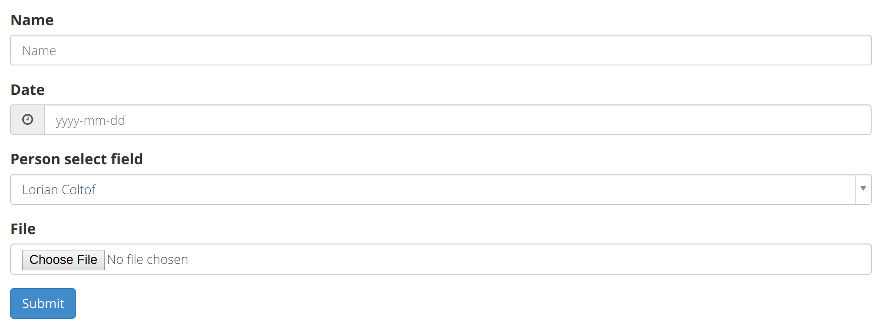
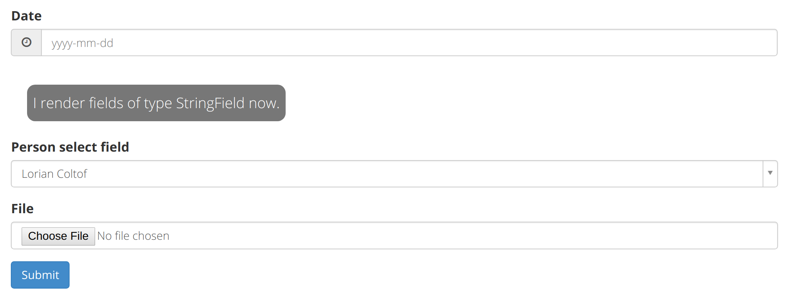
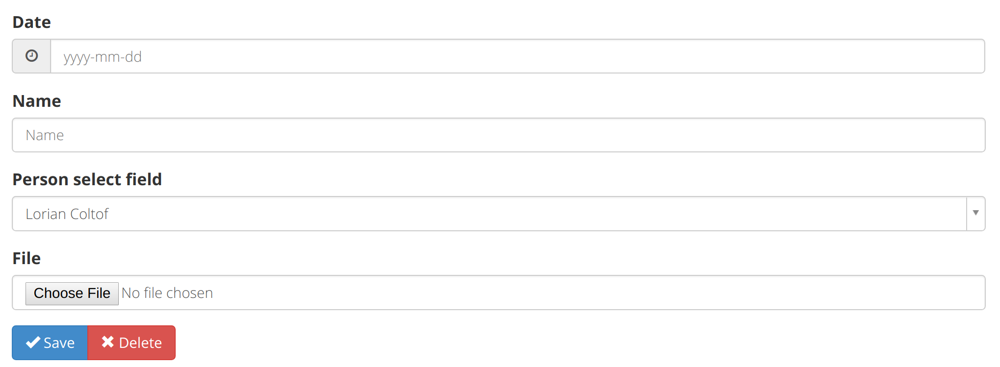
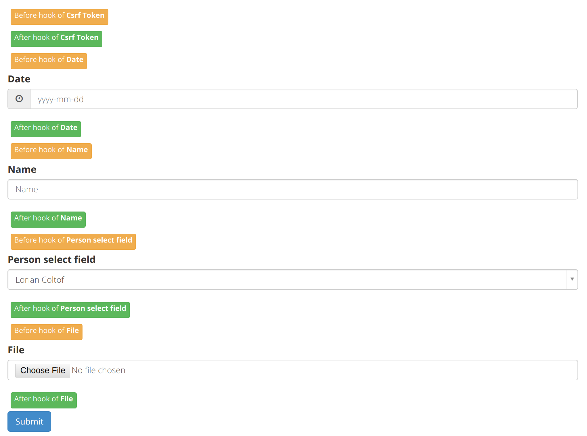
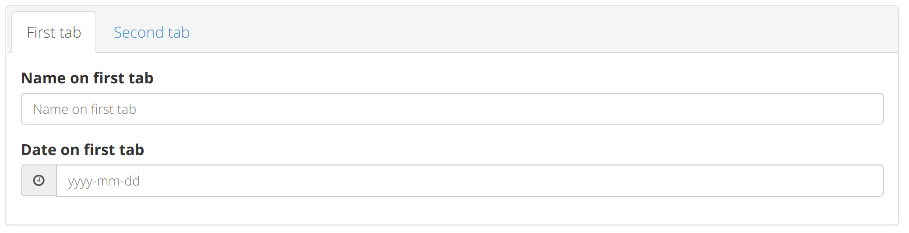
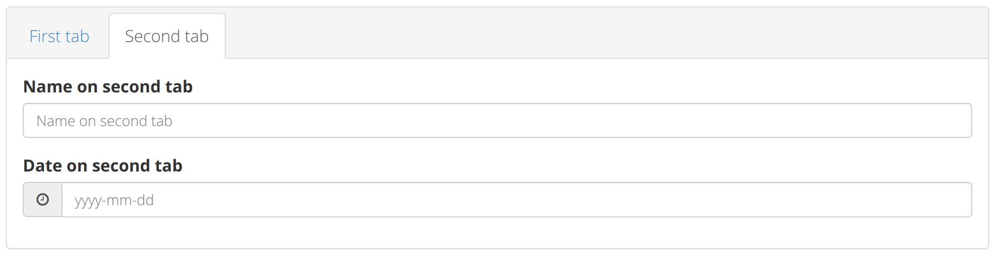
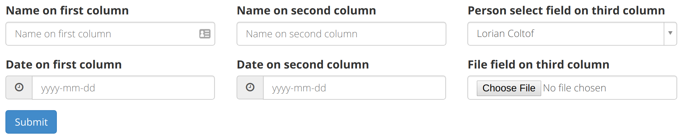
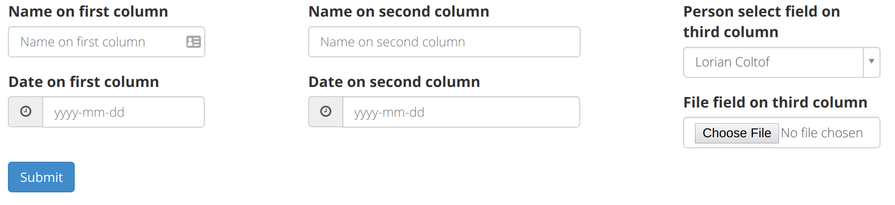

# Forms

For creating forms, see the [WTForms documentation](https://wtforms.readthedocs.io/en/latest/).

## Rendering forms in templates

Forms can be rendered automatically.
This can be done with the `render_form` macro contained in [`macros/form.htm`](../templates/macros/form.htm).

#### Example

Form definition:
```python
class ExampleForm(Form):
    name = StringField(_('Name'), validators=[InputRequired()])
    date = DateField(_('Date'))
    person = QuerySelectField(
        _('Person select field'),
        query_factory=lambda: user_service.find_members())

    file = FileField(_('File'))
```

Route method:
```python
@blueprint.route('/example/', methods=['GET', 'POST'])
def form_example():
    form = ExampleForm()
    return render_template('exampleview/form.htm', form=form)
```

Code in `app/templates/exampleview/form.htm`:
```jinja




{{ render_form(form) }}

```

This will render the form the following way:


The renderer will preserve the order of the fields specified
in the form definition when rendering the form.

#### The render_form macro

```jinja

```
Mandatory parameters:
* ```form```    - The form object to be rendered

Optional parameters
* ```action```      - The URL which will be placed in the 'action' attribute of
                      the `<form>` tag of the rendered form.
* ```form_id```     - The `id` attribute of the `<form>` tag.
* ```form_class```  - The `class` attribute of the `<form>` tag.
* ```form_name```   - The `name` attribute of the `<form>` tag.
* ```submit_text```             - When set, the text of the submit button will
                                  be set to the value of `submit_text`.
* ```extra_field_renderers```   - This field allows for custom render functions per attribute type.
                                  A custom render function of a field type has priority over
                                  the built-in render function.
                                  The argument needs to be a dictionary with the field type as key
                                  and the render function / macro as value.
                                  The render function / macro is called with the field as an argument.
* ```submit_renderer```         - Custom render function for the submit button.
* ```render_before_hook```      - A function / macro which is called for every field just before the
                                  renderer is called.
                                  The function / macro is called with the field that is to be rendered
                                  as an argument.
* ```render_after_hook```       - A function / macro which is called for every field right after the
                                  renderer is called.
                                  The function / macro is called with the field that was just rendered as
                                  an argument.

#### `kwargs`

Every (custom) render macro must take `**kwargs`,
but sometimes there is no use for it.
However, Jinja only lets your macro take `**kwargs` when you use it somewhere.
Therefore, you can call `ignore_kwargs(kwargs)` so your macro
takes `**kwargs` even though you do not really use it.

#### Example

**Form with custom field renderer**


```jinja




<div class="badge" style="margin: 20px">
    <h4>I render fields of type {{ f.type }} now.</h4>
</div>
{{- ignore_kwargs(kwargs) -}}



{{ render_form(form, extra_field_renderers={
                'StringField': my_stringfield_renderer
            }
) }}

```

This will render:


**Form with custom submit renderer**


```jinja




<div class="control-group">
    <div class="controls btn-group">
        <button type="submit" class="btn btn-primary">
            <i class= "glyphicon glyphicon-ok"></i>
            {{ _('Save') }}
        </button>
        <a class="btn btn-danger">
            <i class= "glyphicon glyphicon-remove"></i>
            {{ _('Delete') }}
        </a>
    </div>
</div>




{{ render_form(form, submit_renderer=my_render_submit) }}

```

This will render:


**Form with before/after render hook**

```jinja




<a class="btn btn-warning btn-xs" style="margin: 5px">
    Before hook of {{ f.label }}
</a><br />



<a class="btn btn-success btn-xs" style="margin: 5px">
    After hook of {{ f.label }}
</a><br />



{{ render_form(form,
    render_before_hook=my_render_before_hook,
    render_after_hook=my_render_after_hook) }}

```

This will render:


### Tabs

It is possible to specify a group of tabs and the fields which are contained in the
different tabs of the group.
You can make use of the `FieldTabGroup` and `FieldTab` classes from
`app.forms.util`

#### Example

```python
from app.forms.util import FieldTabGroup, FieldTab

class ExampleForm(Form):
    name_1 = StringField(_("Name on first tab"))
    date_1 = DateField(_("Date on first tab"))

    name_2 = StringField(_("Name on second tab"))
    date_2 = DateField(_("Date on second tab"))

    my_tab_group = FieldTabGroup([
        FieldTab(_("First tab"),  ['name_1', 'date_1']),
        FieldTab(_("Second tab"), ['name_2', 'date_2'])
    ])
```

This will render the tab group in the following way:




### Vertical split

It is also possible to render fields next to each other vertically.
This is called a **vertical split**.
You can include fields in a vertical split using the `FieldVerticalSplit`
class from `app.forms.util`.

Due to the the Boostrap grid system having 12 columns,
you can only use 2, 3, or 4 columns.

#### Example

```python
from app.forms.util import FieldVerticalSplit

class ExampleForm(Form):
    name_1 = StringField(_("Name on first column"))
    date_1 = DateField(_("Date on first column"))

    name_2 = StringField(_("Name on second column"))
    date_2 = DateField(_("Date on second column"))

    person_3 = QuerySelectField(
        _('Person select field on third column'),
        query_factory=lambda: user_service.find_members())
    file_3 = FileField(_("File field on third column"))

    my_vsplit = FieldVerticalSplit([
        ['name_1', 'date_1'],
        ['name_2', 'date_2'],
        ['person_3', 'file_3']
    ])
```



The `FieldVerticalSplit` constructor takes an extra boolean argument
`large_spacing`, which increases the space between the columns:

```python
    ...

    my_vsplit = FieldVerticalSplit([
        ['name_1', 'date_1'],
        ['name_2', 'date_2'],
        ['person_3', 'file_3']
    ], large_spacing=True)
```

will render:



